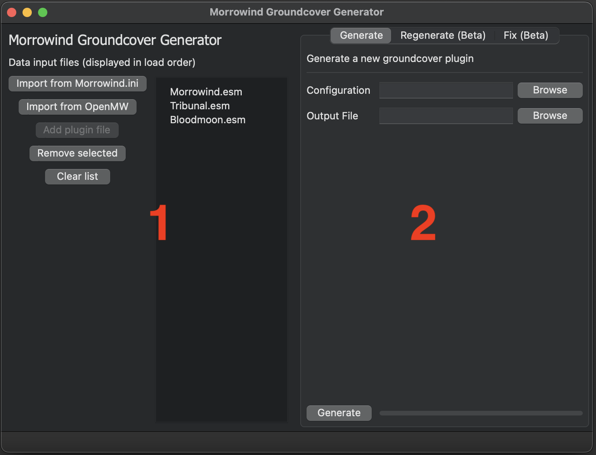
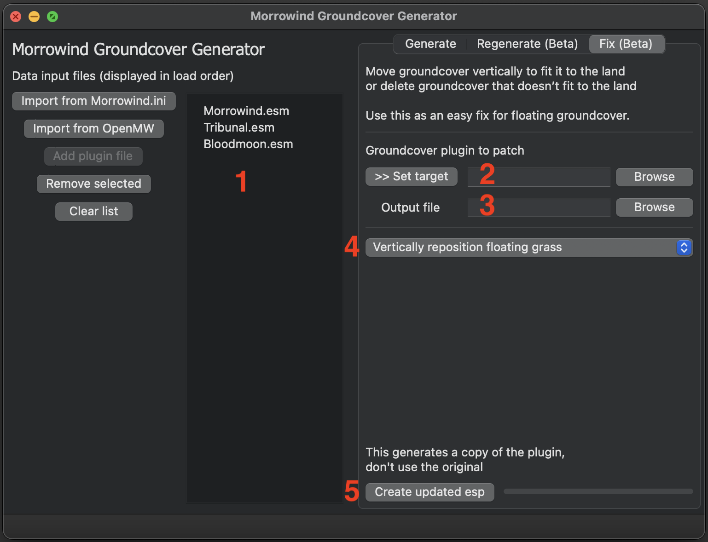
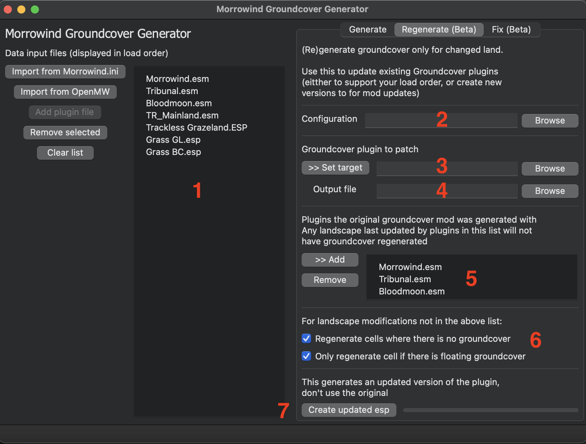
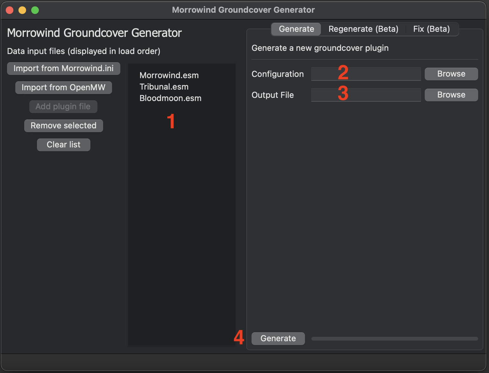

# Morrowind Groundcover Generator (aka MW Mesh Generator)

## Overview



1. The left hand pane has the list of mods that the tools operate on
2. The right hand pane has a set of tools which operate on the plugins in the left hand pane (1)

### Adding plugins
Plugins can be added from your Morrowind.ini (path detected from the system registry on Windows), openmw.cfg ([found using the common paths](https://openmw.readthedocs.io/en/stable/reference/modding/paths.html)) or manually add them by pressing "Add plugin file".

Plugins are displayed in load order. In most cases this uses the last modified time of the file. When importing from OpenMW this uses order defined in openmw.cfg.

When plugins have been imported from OpenMW, it is no longer possible to add plugins manually as it is not possible to determine the load order for the manually added plugin.

## Updating groundcover mods match your active mods

Most groundcover mods are created with a few plugins. Probably just Morrowind, Tribunal, Bloodmoon and maybe Tamriel Rebuilt. This program can update groundcover plugins where the grass differs  

### Quick fixes

Sometimes you have floating grass in your groundcover and you just want to remove it (or update the position)



1. Make sure your list of plugins in the left hand pane is correct (you probably want all your active plugins). Plugins that don't update the land will be automatically ignored
2. Select the groundcover plugin you want to update. You can
   * Select a mod on the left hand pane and press "Set target"
   * Press browse and manually select a mod file
3. Select the save location for the updated mod
4. Select what you want to do with floating groundcover (either update or delete)
5. Press "Create updated esp"

This will generate a copy of the plugin selected in step (2), but with floating grass repositioned.

The main caveat with this approach is that it doesn't account for changes in the texture on the land. e.g. using this tool with the [Trackless Grazelands](https://www.nexusmods.com/morrowind/mods/44194) mod you will still have in gaps in groundcover where the paths once were.

### More in depth fixes by regenerating some goundcover

If you want to regenerate the groundcover for cells that have changed, you can use the *Regenerate* tool



1. Make sure your list of plugins in the left hand pane is correct (you probably want all your active plugins). Plugins that don't update the land will be automatically ignored
2. Select the configuration (ini) file used to generate the groundcover plugin. These are often bundled with groundcover mods
3. Select the groundcover plugin you want to update. You can
    * Select a mod on the left hand pane and press "Set target"
    * Press browse and manually select a mod file
4. Select the save location for the updated mod
5. Select files in the plugin list in (1) that the groundcover mod was generated. Landscape last touched by a mod in this list will never have the groundcover updated. *Note*: Take care with plugin versions - see note below.
6. Select options of what to for landscape cells modified by a mod not in the above list.  
   * When checked and there is no groundcover found in the cell, groundcover will be regenerated for that cell
   * When checked, groundcover will only be regenerated if it has detected floating groundcover in that cell
5. Press "Create updated esp"

This will generate a copy of the plugin selected in step (2), but with groundcover regenerated for any landscape cells that have been updated by other mods

#### Plugin versions

As an example consider the case where there is a new version of Tamriel Rebuilt and we would like to update a groundcover mod.

If we updated Tamriel Rebuilt, and added it to the list of mods to ignore (#5 in the image above), this tool would not generate the correct output because it assumes that the groundcover mod was generated with the new version of Tamriel Rebuilt.

Instead, there are two options you could use with this tool
- Simple: Omit Tamriel Rebuilt from the list of plugins to ignore (#5 in the image above)
- Better: 
  - Rename the Tamriel Rebuilt plugin to "Tamriel Rebuilt Old" 
  - Put "Tamriel Rebuilt Old" before the new version of "Tamriel Rebuilt" in your load order (#1).
  - Add "Tamriel Rebuilt Old" to the list of plugins that the groundcover was built with (#5).
  - Regenerate the groundcover mod
  - Remove "Tamriel Rebuilt Old" from your load order

#### Limitations

This tool aims to be "good enough", but still has plenty of edge cases. As an example consider the case where your groundcover mod has removed grass from Balmora to avoid clipping, but another mod has made landscape edits to Balmora. In this case the tool will regenerate Balmora putting groundcover everywhere

In other words, if you want to make a perfect patch this tool is only a starting point. 

## Making a new groundcover mod

This is a brief overview of creating a new groundcover mod. There is at least one other, slightly more practical guide on the [Project Tamriel website](https://www.project-tamriel.com/viewtopic.php?t=29).


#### Limitations

A big limitation of this tool is that it doesn't take into account other objects
when placing grass. This does result in clipping with rocks and other objects, and is especially bad in cities.

This is a known limitation of this tool, and is unlikely to get fixed (it would require loading meshes and running collision detection. This is feasible to implement but in my opinion the better option is to build better groundcover support into OpenMW by generating groundcover in real time)

One automated fix, not covered in this document, is [LawnMower](https://www.nexusmods.com/morrowind/mods/53034) tool which can trim the groundcover placed by this tool.

### Using the UI




1. Make sure your list of plugins in the left hand pane is correct. This should be just the plugins you want your groundcover mod to target.
2. Select the configuration (ini) file for your groundcover mod (see below)
3. Select the save location for the new groundcover mod
4. Press "Generate" to create the mod

### Configuration

The configuration uses the ini format.

#### Selectors

The ini sections (e.g. `[GL_Grass_03]`) represents a selector for a behaviour (more on that below). The selectors match
a ground texture, with optional additional parameters after a `:`.

- `[GL_Grass_03]` matches any area with the land texture `GL_Grass_03`
- `[GL_Grass_03:Balmora]` matches area with the land texture `GL_Grass_03` in any cell named Balmora
- `[GL_Grass_03:ANY_NAMED_CELL]` matches area with the land texture `GL_Grass_03` in any cell with a custom name (the `ANY_NAMED_CELL` suffix is fixed text which specifies this)
- `[GL_Grass_03:Bitter Coast]` matches area with the land texture `GL_Grass_03` in the region 'Bitter Coast'

Only one behaviour is picked (there is no merging of behaviours). The order in which selectors are checked is:
- Exact cell name (e.g. Balmora with `GL_Grass_03:Balmora`)
- Any cell with a name (e.g. `GL_Grass_03:ANY_NAMED_CELL`)
- The region (e.g. the Bitter Coast region with `GL_Grass_03:Bitter Coast`)
- The texture only (e.g. `GL_Grass_03`)

The motivation for these selectors was to allow for exclusion. For example the following configuration puts groundcover everywhere except in cells with a name (e.g. towns). It isn't known how useful this is in practice as I'm not aware of any groundcover mods using it.

```ini
[GL_Grass_03:ANY_NAMED_CELL]
bPlaceGrass=false

[GL_Grass_03]
bPlaceGrass=true
```


### Behaviours

Generates grass clumps
```ini
bRandClump=false ; Optional, default: false
```

Restrict the height at which meshes can be placed
```ini
fMinHeight=0 ; Optional, default: negative infinity
fMaxHeight=256 ; Optional, default: positive infinity
```

Applies a random position modifier to the groundcover
```ini
fPosMax=100 ; Optional, default: 0
fPosMin=-100 ; Optional, default: 0
```

Assigns a random scale to the object (note that the game engine caps the scale within some bounds)
```ini
fSclMax=1.5 ; Optional, default: 1
fSclMin=1 ; Optional, default: 1
```

When set to true, aligns objects normal to the ground (good for groundcover, not for trees)
```ini
bAlignObjectNormalToGround=true ; Optional, default true
```

Controls how often grass objects are placed, in this case, this places a grass object every 150 units. This is only known to work if it is < 512 units.

```ini
iGap=150 ; Required
```

### Placements

Each section can have different grass objects placed with differing probabilities. 

These configuration keys are suffixed by a index (a `X` placeholder is used below) starting from zero.
```ini
sChanceX=100 ; Required
sMeshX=v7_GS_Grass_01.nif ; one of sIDX or sMeshX is required
sIDX= ; one of sIDX or sMeshX is required
```

- `sChanceX` represents a weight, and the chances don't have to sum to 100
- `sMeshX` (mutually exclusive with `sIDX`) represents the mesh file to use for the placed object instance. If this is set a Static object will be created
- `sIDX` (mutually exclusive with `sMeshX`) represents the object id to use for the placed object instance. This will not be created automatically 

So for example

```ini
sChance0=50
sMesh0=v7_GS_Grass_leaf.nif

sChance1=10
sMesh1=v7_GS_Grass_fern.nif

sChance2=5
sID2=my_id
```

### Exclusions

The randomization of the position of the groundcover can result it it spilling onto other textures. In some cases you don't want this to happen - for example with roads. Exclusions (or bans) can be used to stop this behaviour.

Don't place grass on `GL_Dirtroad`, even if random distribution puts it there
```ini
sBanX=GL_Dirtroad
```

The offset (default `0`) can be used to ensure that it isn't placed within some number of units of `GL_Dirtroad`
```ini
iBanOffX= ; Optional, default: 0
```

### Global behaviours

The section `[global]` contains settings which are applied to all placed objects.

```ini
[global]
iZPositionModifier=10; Optional, default 10
sObjectPrefix=GRS_ ; Optional, deprecated, default GRS_
```

- `iZPositionModifier` Applies a fixed delta to the z (vertical) position of all placed objects
- `sObjectPrefix` The prefix of any created Static objects.  This setting may be removed in a future version of this program

## Troubleshooting

Logs are written to MwGroundcoverGenLog.txt. This includes details of
- The parsed configuration used
- What plugins where loaded
- The selector used and the actions taken for each cell

This can be useful to diagnose issues
